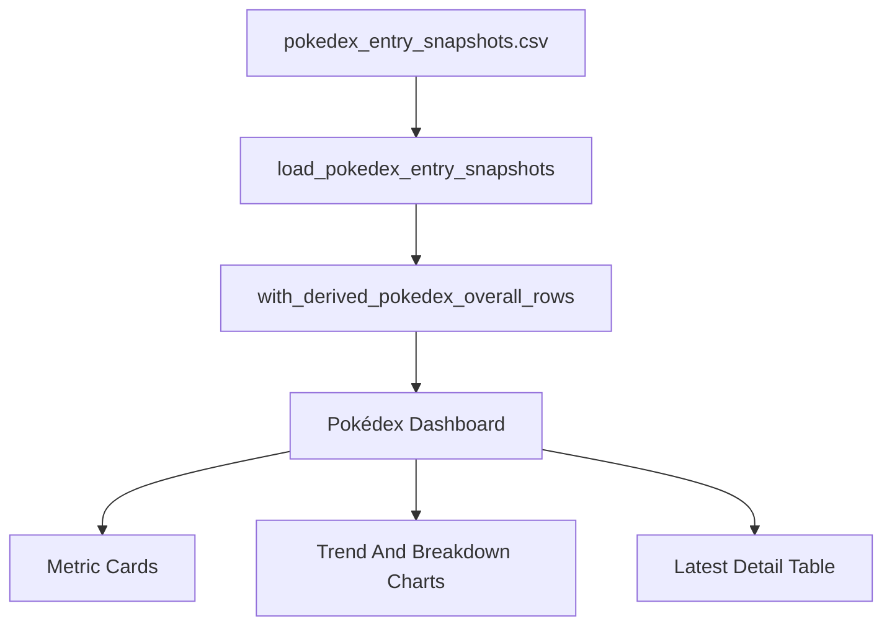

# Pokédex Entry Dashboard Plan

## Dashboard Shape
- Add a new page entry, `Pokédex Dashboard`, to [`webapp/app.py`](webapp/app.py), near the existing `Dashboard Global`, `Dashboard Personal`, and `Medal Explorer` pages.
- Build dashboard data from saved Pokédex entry snapshots in [`inputs/data/pokedex_entry_snapshots.csv`](inputs/data/pokedex_entry_snapshots.csv), plus derived `overall` rows via `with_derived_pokedex_overall_rows(...)`.
- Do not use medal-derived regional `pokemon` rows as main dashboard values. Regional medal values may be shown only as optional reference data after `.cursor/plans/separate_pokedex_medal_saves.plan.md` is implemented.
- Treat `.cursor/plans/separate_pokedex_medal_saves.plan.md` as a prerequisite for reliable regional `pokemon` dashboard history, because it seeds historical `pokemon` rows into the Pokédex entry snapshot CSV.
- Keep this dashboard read-only. No new data files are needed.

## User Controls
- Add controls for:
  - account selection, defaulting to accounts with Pokédex data
  - date range, defaulting to the full available Pokédex snapshot range
  - entry type filter: Pokemon, Shiny, Lucky, XXL, XXS, G-Max, Mega, Shadow, Purified, 100%
  - view mode: Latest, Progress Over Time, Region Breakdown
- Reuse existing labels from `POKEDEX_ENTRY_TYPE_LABELS` and `POKEDEX_REGION_LABELS` so names stay consistent with the input UI.

## Main Dashboard Sections
- Header metrics:
  - latest snapshot date
  - selected account count
  - total latest Overall Pokemon, Shiny, Lucky, and 100% counts where available
- Latest Account Comparison:
  - one grouped bar chart comparing latest `overall` values by account and entry type
  - useful for quickly seeing who leads each Pokédex category
- Category Trend:
  - line chart over time for selected entry types, using `region == "overall"`
  - account-colored lines using the existing account color helper if practical
- Region Breakdown:
  - stacked or grouped bar chart for one selected account/date/category across non-overall regions
  - exclude derived `overall`; include `unidentified`
- Detail Table:
  - latest values by account, entry type, and region
  - hide raw technical columns where possible, but keep values sortable

## Data Flow

## Implementation Notes
- Add small helper functions in [`webapp/app.py`](webapp/app.py) unless the dashboard grows large enough to justify a new view module under [`webapp/views/`](webapp/views/).
- Prefer Plotly figures rendered through `render_plotly_chart(...)` for consistency with the existing dashboards.
- Filter only after saved Pokédex entry rows have derived `overall` rows added, so all dashboard views use the same canonical Pokédex values.
- For latest values, sort by `date` and use `groupby(["account", "entry_type", "region"]).tail(1)`.
- Treat empty data gracefully with `st.info(...)` and avoid crashes when there are no rows for a selected account/date/category.
- If medal reference values are added later, look them up separately by account/date/region and label them clearly as medal references, not Pokédex entry counts.

## Verification
- Add focused tests for any new pure helper functions, especially latest-value shaping and regional breakdown shaping.
- Run `python -m unittest -v tests.test_data_files tests.test_pokedex_entries` plus any new Pokédex dashboard tests.
- Manually verify the new page in Streamlit with current sample data, checking empty states, account filters, and category/region charts.